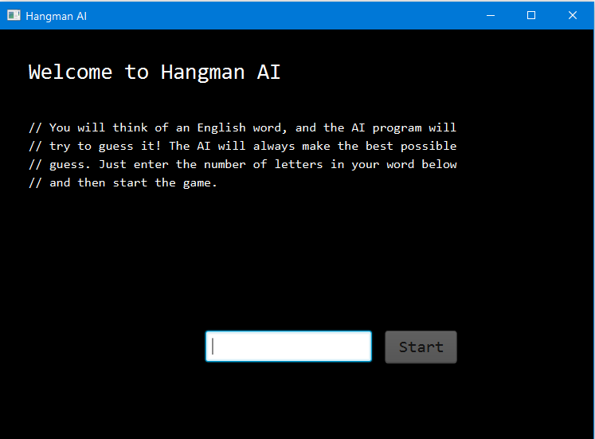
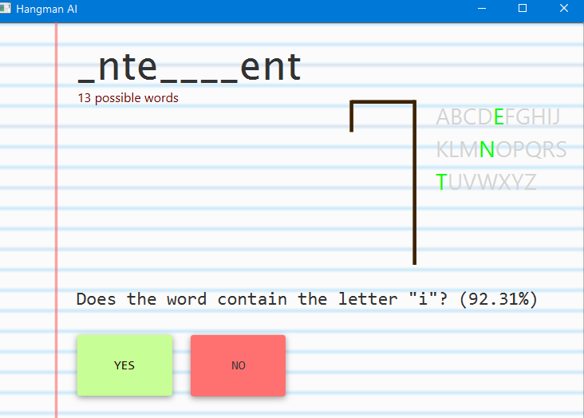
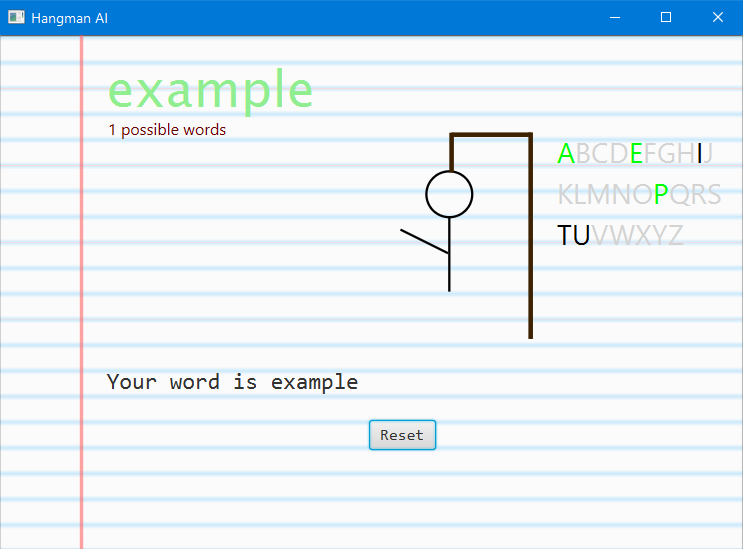
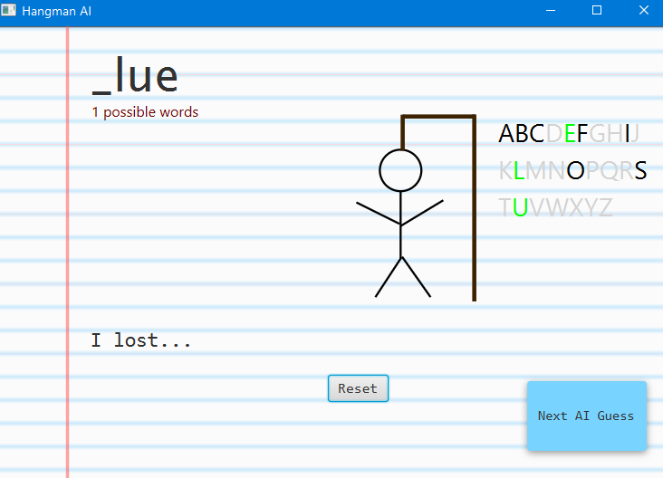
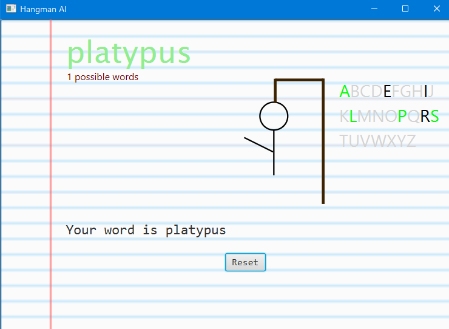

# Hangman AI
*Simple reflex agent built in JavaFX*

Hangman AI is a very basic Simple Reflex Agent that is used to guess the word that the
user is thinking of. The user begins by thinking of any English word and then inputting the
number of letters in the word, as is typical in a game of Hangman. The user never has to tell the
program what word they thought of to ensure that there is no “cheating” on the AI’s part. The AI
will then begin asking the user questions to determine what letters the word contains. If the AI
gets more than six guesses incorrect, it “loses.” However, unless the word is particularly short,
the AI will usually win.

In the middle of guessing the word "Intelligent"

Succesfully guessing "example"

Failing to guess "glue" because it is a word with only four letters 

The Hangman AI decides on guesses by using an “analyze” method. It reads in the
current dictionary and determines which letter is the most prevalent (multiple occurrences in a
single word do not contribute to prevalence). After asking the user if the letter exist, the
Hangman AI will alter the current dictionary. If the answer is “yes,” then the AI will ask for the
locations of that letter in the word and cut out all words in the dictionary that do not match. If the
answer is “no,” then the AI will remove all letters from the dictionary containing that word.

Hangman AI is a Simple Reflex Agent because it lacks the abilities to analyze historical
games or learn from itself and change itself. The AI works by using a set of predefined
conditionals and methods and selects actions based on the current precept. I decided on a Simple
Reflex Agent due to simplicity and because I felt that this agent would make for a fun project.

Below is a description of the task environment:

**Environment:** The environment of Hangman AI is the game interface and the English language
dictionary, or whatever other language or library of words the user chooses to use.

**Sensors:** The sensors for Hangman AI include: FileReaders and BufferedReaders for reading .txt
files, keyboard scanners, textbox inputs from users, and button inputs from users. It uses the
sensors to receive information about the letters that the word does or does not contain.

**Actuators:** The Hangman AI actuates its purpose via visual elements and updated Strings in the
game. The AI is continuously building a String called “currentWord” that initially starts as a
sequence of underscores but is updated as the AI gains more information on the user’s word.

**Performance measures:** Performance is measured by the number of incorrect guesses and
whether or not the program guesses the user’s word.

